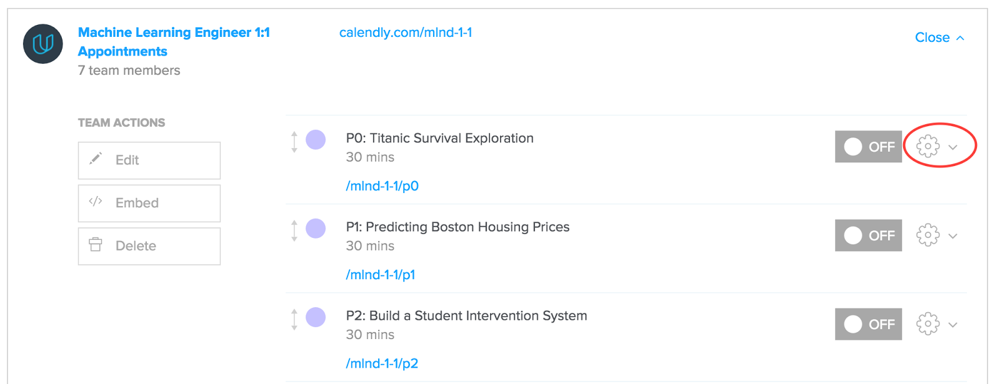
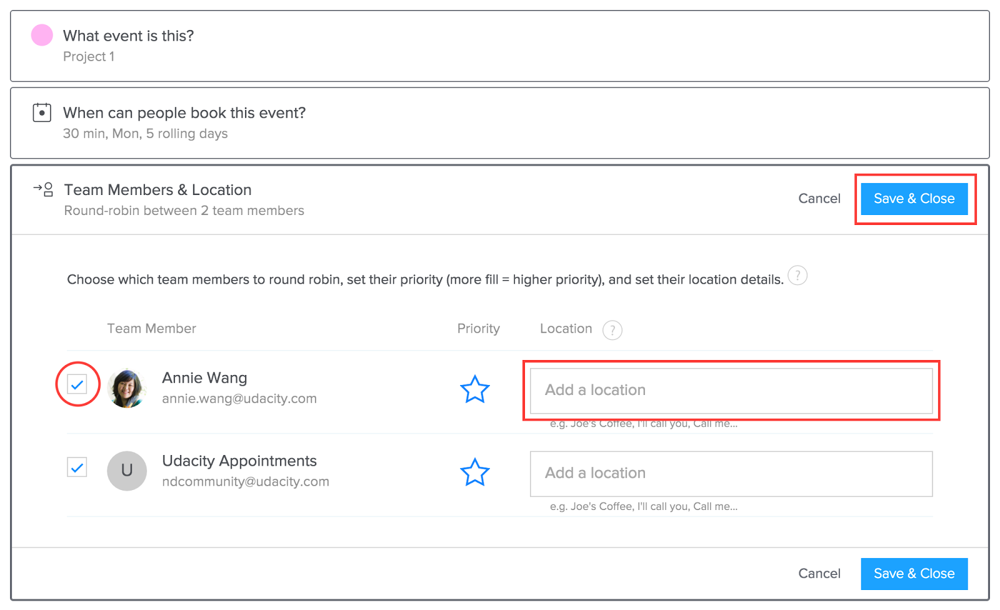

## If you already have Calendly set up… {#if-you-already-have-calendly-set-up}

Please follow these instructions to switch over to the new system!

1.  Go to the calendar connected to your email account and block off all the times you will not be available (ie Google Calendar if you signed up with a Gmail account, etc.). Calendly communicates with your calendar in order to generate available times for appointments. Since Mentors are located all over the world, Calendly will search for available times 24 hours a day, so it is imperative that you keep your Calendar up-to-date.

    **Example:** If you do not want to take appointments between the hours of 8PM and 10AM in your timezone, create an event and label it something like ”Busy” or “Not taking appointments” for yourself. Calendly will know to mark you as Unavailable during those times.

    **Tip:** Most calendar apps have the option to set recurring events. If you are afraid that you will forget to create a new event to account for your unavailability hours, make use of this feature!

    **Tip:** We have set Calendly to allow users to schedule appointments up to 14 days in advance, but if you are going on vacation or otherwise won’t be available for a day or more, you can mark yourself as unavailable as far into the future as needed.

    **Tip:** More information can be found on this Calendly help article: [I’m unavailable when I should be free](http://help.calendly.com/article/114-im-unavailable-when-i-should-be-free)

2.  Click the gear icon next to each event type:

3.  Click “Team Members and Location to trigger a drop-down:

    Check your name only if you want to take 1:1 appointments for that project. Under Location, input: `“We’ll be meeting on Zoom. Join here at your appointment time: [url]”` Instructions to set up your persistent Zoom URL can be found [here](https://drive.google.com/file/d/0B5bRk1eOyktZUEVKdk9BZFk3WkU/view?usp=sharing)!

4.  Remember to save your changes!
5.  Turn your individual event type to “Off”.